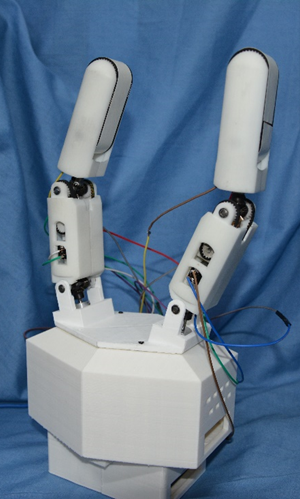
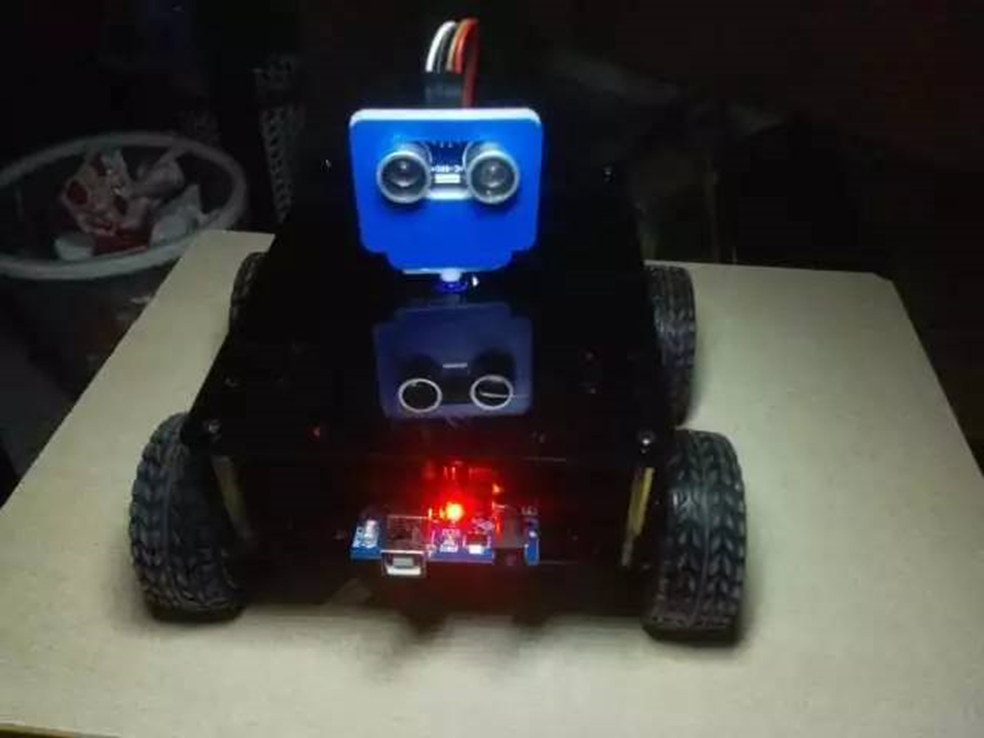
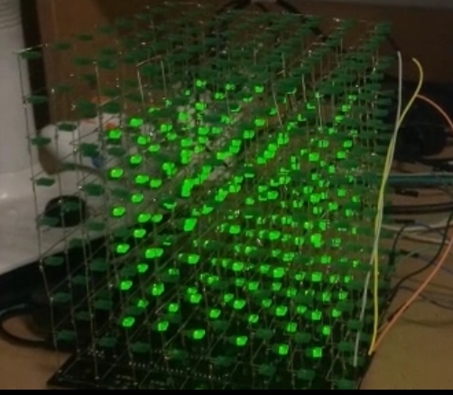
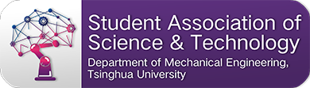

Student Team of Interest
========================
General
------------------------
Student Team of Interest (STI), attached to the DME SAST (the Student Association of Science & Technology, Department of Mechanical Engineering), is an open organization for students interested in technology research and application. We make every effort to encourage and support creation and innovation among students of the Department of Mechanical Engineering.

Aims
------------------------
STI is mostly based on individual projects, including: 

■	Competition projects:

Projects that aims for competitions such as Challenging Cup, Mechanical Design & Innovation Competition and Electronic Design Contest. 

■	Research projects:

Based on research programs, the teams works towards advanced technology and innovation to make academic achievements. 

■	Application projects: 

Design new products to meet the need of the market, or use design and manufacture skills to solve practical problems.

Field of Projects
------------------------
Students of interest can organize their own team, or find team members with the help of the Association. The field of the projects are not limited to mechanical engineering only. Electronic design, product design and volunteering activities of science and technology education are also welcomed. Any project that activates interests and promote progress in science and technology will be sponsored.

Operation & Management
------------------------
STI collects project applications in spring semester. An application form is required for assessment. After passing the assessment, the team is officially a part of STI project teams. Each team can proceed according to their own schedule and get any possible support from the Association. STI will check the progress of each team regularly and organize seminars for intergroup communications.

Supports
------------------------
Each team will get a 2,000-yuan fund for their project. The Association will also provide professional technical training courses to ensure the steady progression of each project. We can also get help from teachers and experienced senior students if needed. Our room for activities locates in A314 in Lee Shau Kee’s Building. In the room, we provide most-used materials, tools and machines, including 3D printer, laser-cutting machine, drilling machine, etc. iCenter will also help to solve complex machining problems.

Past Projects
------------------------
 ■	In 2016，we set up 4 starter projects for the freshman，including quadrotor，balance car，automatic obstacle avoiding car and gear clock.

 ■	Every year, we receive many creative and interesting project applications. Some of them also make great achievement in school competitions and research programs.

>   Skin-changeable manipulator (A Challenge Cup project)

>   Automatic obstacle avoiding car

>   Light cube

All copyrights reserved by THU-DMESAST.

